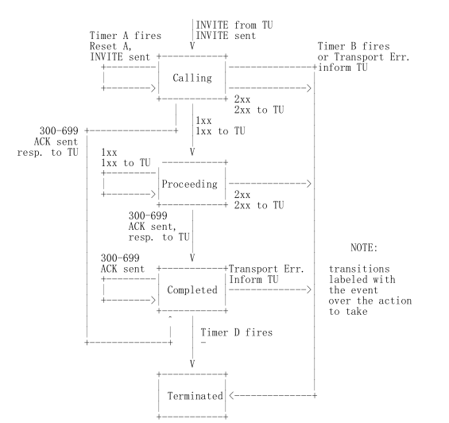
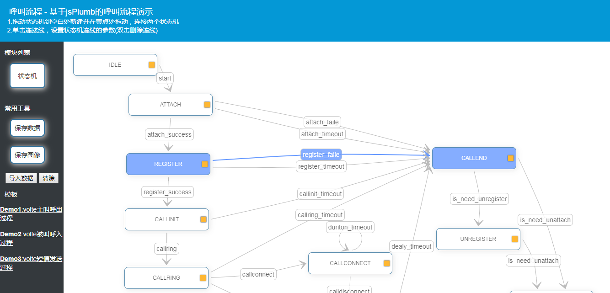

# jsplumb-statemachine


## 1.1 背景和目标
先说下这个项目想要解决的实际问题。  
之前一直在做呼叫流程控制的程序，涉及到的业务流程非常多，经常需要根据业务流程的变化变更代码。
现在想要把业务流程部分通过前端编辑的方式进行重排，最后选型jsplumb作为前端控制组件。
主要实现以下功能：

- 通过拖拽的方式实现状态机模型的绘制和连接
- 能够保存所绘制的模型关系并以文件存储
- 能够通过绘制的关系正确执行对应的业务流程

本例子中的状态机业务为volte中的呼叫业务，volte中使用SIP协议，在理解业务的时候最好向阅读SIP相关文档，对
SIP的事务状态机有一定的了解。下图为SIP协议的事务状态机：  



在实际例中按照使用者对电话的理解将状态机抽象成CALLINIT(准备呼叫)、CALLRING(振铃状态)、CALLCONNECT(摘机状态)、CALLDISCONNECT(挂机状态)、
CALLEND(呼叫结束状态)。这几个状态对普通电话也适用，针对手机增加了ATTACH(附着状态)、针对VOLTE增加了REGISTER(SIP注册状态)，对应也增加了DEATTCH(去附着状态)和
UNREGISTER(注销状态)。
	
## 1.2 jsplumb基本介绍	

关于jsplumb的基本知识这里不做介绍，可以自行参考官网的文档和网友贡献的中文文档。  
官方地址 https://jsplumbtoolkit.com//
	
## 1.3 jsplumb的状态机模型

jsplumb支持多种图形绘制，此处只是用了jsplumb的 statemathine功能。
	
## 1.4 jsplumb前端效果

DEMO地址：http://www.51pcap.com/callflow 


## 2.1 jsplumb的设计
本demo参考了github上的jsworkflow项目，为了满足需求进行了改动。
增加了lable参数，增加了保存、导入、清除、拖拽功能，对存储的结构按需要进行优化。

### 2.2 增加lable参数
为使绘制的图形能传递完整信息，需要在绘制的线上增加参数。jsplumb关于lable部分是通过overlays来实现，  
默认参数下会创建ConnectionOverlays图层，id设置为defaultlabel。  
```
// Import all the given defaults into this instance.
instance.importDefaults({
    Endpoint: ["Dot", {
        radius: 0.1
    }],
    HoverPaintStyle: {
        strokeStyle: "#6699FF",
        lineWidth: 2
    },
    ConnectionOverlays: [
        ["Arrow", {
            location: 1,
            id: "arrow",
            length: 14,
            foldback: 0.4
        }],
       
        ["Label", {
            //label: "transition",
            id: "defaultlabel",
            cssClass: "aLabel",
            events:{  
               click (label) {
                 // var bc=prompt("shuru...");
                  // label.setLabel(bc);
                 }
            }
        }]                    
    ],
```
在手动拖动创建连线时创建的是overlay图层 ,id设置为connectlable。
```
instance.createStateTrasitions = function (workflowData) {
    var transitions=workflowData.transitions,
        source,target,label;

    for (var tr in transitions) {
    	var trx=transitions[tr];
					labtext = trx["label"];
       var conn=instance.connect({
            source: trx["source"],
            target: trx["target"],
						labelStyle: {cssClass: "aLabel",},
						overlays: [
          	//ConnectionOverlays: [
          	["Label", {
                  cssClass: "aLabel",
                  label: labtext,
                  location: 0.5,
                  id: "connectlabel",
              }],
						]
        });
        //conn.setLabel(trx["label"]);
```
导入的和手动绘制的两个图层不一样，在修改和保持时进行了判断。这里对overlay的理解还不是很透彻，或许有更好的
处理办法。

### 2.3 保存参数设计
内容用JSON个是存储,transitions下记录了原状态到目的状态，lable记录的中间的触发参数。  
names记录了所有的状态机变量，positions记录的是所在位置，从文件导入到web页面上使用，在做状态机解释时候不需要。    
```
{
	"transitions": {
		"tr0": {
			"source": "idle",
			"target": "attach",
			"label": "start"
		},
		"tr1": {
			"source": "attach",
			"target": "register",
			"label": "attach_success"
		},
		"tr2": {
			"source": "attach",
			"target": "callend",
			"label": "attach_faile"
		},
		"tr3": {
			"source": "attach",
			"target": "callend",
			"label": "attach_timeout"
		},
		"tr4": {
			"source": "register",
			"target": "callend",
			"label": "register_faile"
		},
		"tr5": {
			"source": "register",
			"target": "callend",
			"label": "register_timeout"
		},
		"tr6": {
			"source": "callend",
			"target": "unregister",
			"label": "is_need_unregister"
		},
		"tr7": {
			"source": "callend",
			"target": "unattach",
			"label": "is_need_unattach"
		},
		"tr8": {
			"source": "unregister",
			"target": "unattach",
			"label": "is_need_unattach"
		},
		"tr9": {
			"source": "register",
			"target": "messagemo",
			"label": "register_success"
		},
		"tr10": {
			"source": "messagemo",
			"target": "callend",
			"label": "message_success"
		},
		"tr11": {
			"source": "messagemo",
			"target": "callend",
			"label": "message_faile"
		},
		"tr12": {
			"source": "messagemo",
			"target": "callend",
			"label": "message_timeout"
		}
	},
	"names": {
		"idle": "IDLE",
		"attach": "ATTACH",
		"register": "REGISTER",
		"callend": "CALLEND",
		"unregister": "UNREGISTER",
		"unattach": "UNATTACH",
		"messagemo": "MESSAGEMO"
	},
	"positions": {
		"idle": {
			"top": 147,
			"left": 368.90625
		},
		"attach": {
			"top": 263,
			"left": 305.90625
		},
		"register": {
			"top": 384,
			"left": 291.90625
		},
		"callend": {
			"top": 303,
			"left": 954.859375
		},
		"unregister": {
			"top": 473,
			"left": 896.859375
		},
		"unattach": {
			"top": 581,
			"left": 1091.859375
		},
		"messagemo": {
			"top": 508,
			"left": 515.6875
		}
	},
	"container": "workflow-2"
}
```

## 3.1 状态机解释器的设计
在设计状态机解释器时首先需要掌握状态机的数学模型公式：  
有限状态机是一个五元组M=(Q,Σ,δ,q0,F)，其中：  
Q={q0,q1,...,qn}是有限状态集合。在任一确定的时刻，有限状态机只能处于一个确定的状态qi；  
Σ={σ1,σ2,...,σn}是有限输入字符集合。在任一确定的时刻，有限状态机只能接收一个确定的输入σj；  
δ:Q×Σ→Q是状态转移函数，在某一状态下，给定输入后有限状态机将转入状态迁移函数决定的一个新状态；  
q0∈Q是初始状态，有限状态机由此状态开始接收输入；  
F∈Q是最终状态集合，有限状态机在达到终态后不再接收输入。  

在本例中状态机的的状态Q设计为  
Q={IDLE,ATTACH,REGISTER,CALLINIT,CALLRING,CALLCONNECT,CALLDISCONNECT,CALLEND,UNREGISTER,DEATTACH};  

Σ={start,attach_success,attach_faile,attach_timeout,register_success,register_faile,register_timeout,
callring,callinit_timeout,callring_timeout,callconnect,calldisconnect..........}  

δ是每一个事件对应执行的动作  
δ={before_start2attach().before_attach2reg(),before_attach2callend(),..........}  

初始状态q0= IDLE  

最终状态F = DEATTACH  


## 3.2 状态机解释器的代码demo实现
为了实现以上的数学定义，使用了python下的transitions来解析。  
具体介绍可以参考官方文档  https://github.com/pytransitions/transitions  

所有的状态机都需要有定时器处理，因此需要使用transitions的timeout扩展属性  

先定义state变量，假设都超时10秒，超时后执行超时函数并触发超时事件。
```
states = [{'name': 'IDLE'},
          {'name': 'ATTACH','timeout': 10, 'on_timeout':['on_timeout_attach','attach_timeout']},
          {'name': 'REGISTER', 'timeout': 10, 'on_timeout': ['on_timeout_register','register_timeout']},
          {'name': 'CALLINIT','timeout': 10, 'on_timeout': ['on_timeout_callinit','callinit_timeout']},
          {'name': 'CALLRING','timeout': 10, 'on_timeout': ['on_timeout_callring','callring_timeout']},
          {'name': 'CALLCONNECT','timeout': 10, 'on_timeout': ['on_timeout_callconnect','callconnect_timeout']},
          {'name': 'CALLDISCONNECT','timeout': 10, 'on_timeout': ['on_timeout_calldisconnect','calldisconnect_timeout']},
          {'name': 'CALLEND','timeout': 10, 'on_timeout': ['on_timeout_callend']},
          {'name': 'UNREGISTER','timeout': 10, 'on_timeout': ['on_timeout_unregister','unregister_timeout']},
          {'name': 'DEATTACH','timeout': 10, 'on_timeout': ['on_timeout_deattach','deattach_timeout']}
          ]
```

然后定义触发器，这里可以根据jsplumb编写的json文件自动转换成这两个定义。  
```
transitions = [
    {'trigger': 'start', 'source': 'IDLE', 'dest': 'ATTACH', 'before': 'before_start2attach'},
    {'trigger': 'attach_success', 'source': 'ATTACH', 'dest': 'REGISTER', 'before': 'before_attach2reg' },
    {'trigger': 'attach_faile', 'source': 'ATTACH', 'dest': 'CALLEND', 'before': 'before_attach2callend' },
    {'trigger': 'attach_timeout', 'source': 'ATTACH', 'dest': 'CALLEND', 'before': 'before_attach2callend' },
    {'trigger': 'register_success', 'source': 'REGISTER', 'dest': 'CALLINIT', 'before': 'before_reg2callinit' },
    {'trigger': 'register_faile', 'source': 'REGISTER', 'dest': 'CALLEND', 'before': 'before_reg2callend' },
    {'trigger': 'register_timeout', 'source': 'REGISTER', 'dest': 'CALLEND', 'before': 'before_reg2callend' },
    {'trigger': 'callring', 'source': 'CALLINIT', 'dest': 'CALLRING', 'before': 'before_reg2callinit'},
    {'trigger': 'callinit_timeout', 'source': 'CALLINIT', 'dest': 'CALLEND', 'before': 'before_reg2callend'},
    {'trigger': 'callring_timeout', 'source': 'CALLRING', 'dest': 'CALLEND', 'before': 'before_callring2callend'},
    {'trigger': 'callconnect', 'source': 'CALLRING', 'dest': 'CALLCONNECT', 'before': 'before_reg2callend'},
    {'trigger': 'calldisconnect', 'source': 'CALLRING', 'dest': 'CALLDISCONNECT', 'before': 'before_callring2calldisconnect'},
    {'trigger': 'calldisconnect', 'source': 'CALLCONNECT', 'dest': 'CALLDISCONNECT', 'before': 'before_callconnect2calldisconnect'},
    {'trigger': 'callconnect_timeout', 'source': 'CALLCONNECT', 'dest': 'CALLCONNECT', 'before': 'timeout2handup'},
    {'trigger': 'callend_timeout', 'source': 'CALLEND', 'dest': 'CALLEND', 'before': 'before_reg2callend'},
]
```

实现类函数  

```
from time import sleep
from transitions import Machine
from transitions.extensions.states import add_state_features, Tags, Timeout
import threading
from queue import Queue
from threading import *

@add_state_features(Tags, Timeout)
class JsExtenStateMachine(Machine):
    pass

class VolteCallStateMachine(object):
    def __init__(self):
        self.entourage = 0

    #超时处理函数
    def on_enter_waiting(self):
        self.entourage += 1

    def on_timeout_attach(self):
        print ("on_timeout_attach dosomthing")

    def on_timeout_register(self):
        print ("on_timeoute_register do something")		
        
		....
		实现每个函数功能
		
```

例子函数中做了两个队列，一个模拟输入事件，一个取出事件，因为事件都是字符串，因此需要需要转换成
函数处理，使用了getattr函数。  

```
# 从队列中取出事件并执行到最终的状态
def geteventsfromqueue():

    sleep(2)
    print("start geteventsfromqueue")

    while(1):
       print(q.qsize())
       event = q.get()
       print ('recv event = '+event)
       func = getattr(volte401,event, None)
       func()
       print("now state=" + volte401.state)
       sleep(3)

```

## 3.3 测试代码运行

python3.6  
安装transitions后直接运行  


## 4.1 可改进部分

lable参数可设计数据格式，增加比如timeout时长，条件等。  
例子可以设计成 项2= 参数1，项目2=参数2  
如fun=xxxx,timer=10表示执行什么函数，超时时长多少。  

lable中的参数是输入的，可以设计成下拉方式被选择，减少输入时的错误。  

本例中用的transitions在实际项目中的性能存在疑问，使用transitions只是鉴于好理解状态机的设计模式，在设计
使用中比如用于sip状态机模型对定时器的要求很高，很多定时器要求需要达到200ms或以下，目前的秒级定时器无法满足要求。